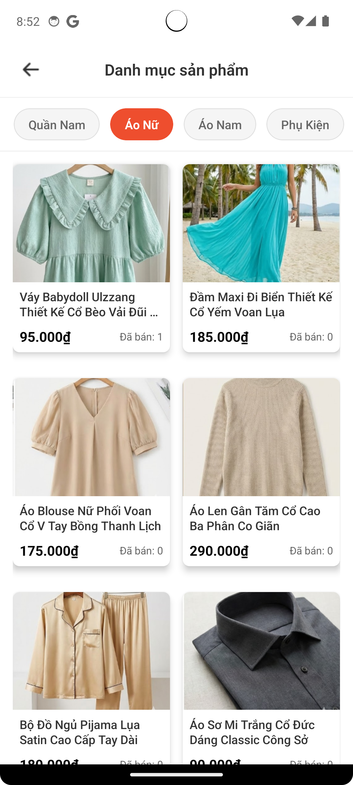
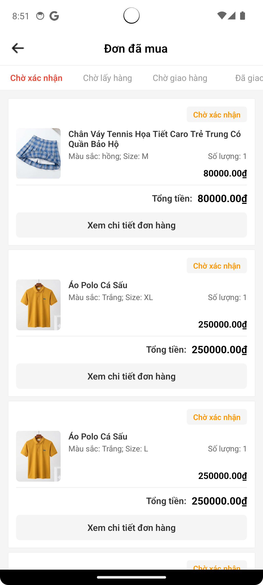
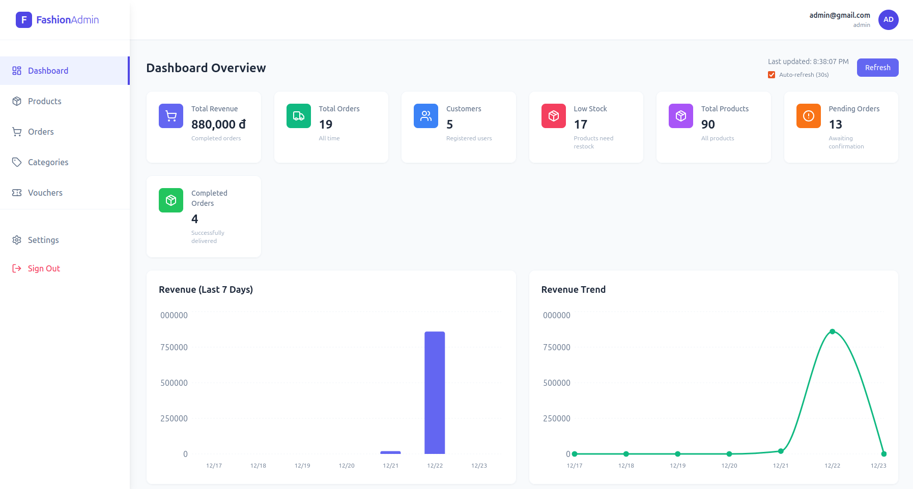
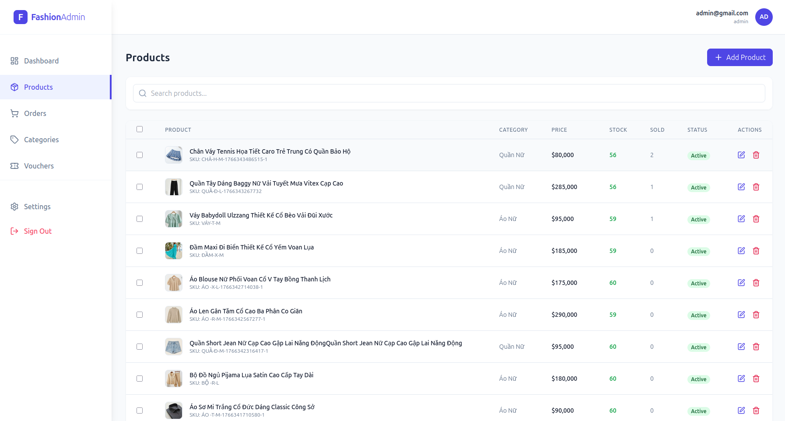
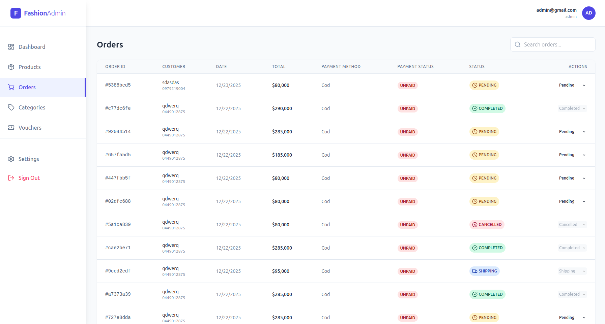
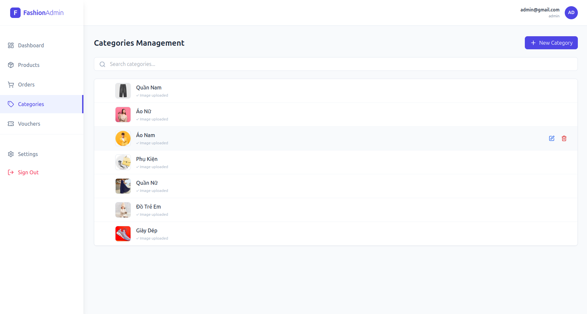
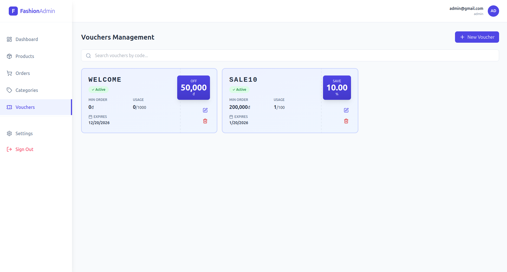

# 🛍️ DoubleD Fashion - Hệ thống Thương mại Điện tử Thời trang

## 📑 Mục lục (Table of Contents)

1. [Giới thiệu](#1-giới-thiệu-introduction)
2. [Mục đích & Mục tiêu](#2-mục-đích--mục-tiêu-goals--objectives)
3. [Phạm vi dự án](#3-phạm-vi-dự-án-scope-of-work)
4. [Kiến trúc & Công nghệ](#4-kiến-trúc--công-nghệ-architecture--tech-stack)
5. [Chức năng chi tiết](#5-chức-năng-chi-tiết-detailed-features)
6. [Thiết kế Cơ sở dữ liệu](#6-thiết-kế-cơ-sở-dữ-liệu-database-schema)
7. [UI/UX Design](#7-uiux-design)
8. [Yêu cầu phi chức năng](#8-yêu-cầu-phi-chức-năng-non-functional-requirements)
9. [Tài liệu API](#9-tài-liệu-api-api-documentation)
10. [Hướng dẫn cài đặt](#10-hướng-dẫn-cài-đặt-local-development)
11. [Hướng dẫn Deploy](#11-hướng-dẫn-deploy-deployment-guide)
12. [Kết luận](#12-kết-luận-conclusion)

---

## 1. Giới thiệu (Introduction)

DoubleD Fashion (Mã dự án: se2025_13.1) là một giải pháp thương mại điện tử toàn diện (End-to-End Solution) chuyên biệt cho ngành thời trang theo mô hình B2C (Business to Customer).

Hệ thống được thiết kế để giải quyết bài toán quản lý sản phẩm đa biến thể (Màu sắc/Kích cỡ) phức tạp, đồng thời tối ưu hóa trải nghiệm mua sắm trên thiết bị di động thông qua các luồng nghiệp vụ hiện đại như "Lazy Auth" (Mua trước - Đăng ký sau) và "Sưu tầm Voucher".

Hệ sinh thái bao gồm:

    Mobile App (React Native): Ứng dụng dành cho khách hàng với trải nghiệm Native mượt mà.

    Web Admin (ReactJS): Dashboard quản trị trực quan dành cho người bán.

    Backend (NodeJS): Hệ thống API hiệu suất cao, xử lý logic nghiệp vụ phức tạp.

    Infrastructure: Triển khai đồng bộ trên môi trường Docker.

Link triển khai Web-Admin có thể xem thêm [Tai day](http://se2025fashion.duckdns.org:5173/)

## 2. Mục đích & Mục tiêu (Goals & Objectives)

### 2.1. Mục đích dự án (Project Goals)

    Mục đích cốt lõi của dự án được chia thành ba khía cạnh:

    1. Về mặt Nghiệp vụ (Business Goals):

        - Số hóa quy trình bán hàng truyền thống, từ khâu quản lý kho, niêm yết sản phẩm đến xử lý đơn hàng và giao vận.

        - Giải quyết bài toán đặc thù của ngành thời trang: Quản lý sản phẩm đa biến thể (SKU management) với ma trận Màu sắc - Kích cỡ phức tạp.

        - Tối ưu hóa tỷ lệ chuyển đổi (Conversion Rate) thông qua các luồng trải nghiệm người dùng hiện đại như "Lazy Auth" (Mua trước - Đăng ký sau) và hệ thống Voucher thông minh.

    2. Về mặt Kỹ thuật (Technical Goals):

        - Xây dựng hệ thống có kiến trúc Microservices-ready, tách biệt rõ ràng giữa Client (Mobile/Web) và Server (Backend API).

        - Đảm bảo tính toàn vẹn dữ liệu (Data Integrity) tuyệt đối trong các giao dịch tài chính và tồn kho.

        - Ứng dụng các kỹ thuật tối ưu hiệu năng (Caching, Indexing, Asynchronous Processing) để hệ thống vận hành mượt mà dưới tải cao.

    3. Về mặt Học thuật (Educational Goals):

        - Làm chủ quy trình phát triển phần mềm chuyên nghiệp (SDLC).

        - Thực hành triển khai DevOps cơ bản với Containerization (Docker).

### 2.2. Mục tiêu cụ thể (Project Objectives)

A. Backend & Database (Hệ thống lõi)

    Kiến trúc phần mềm:

        - Xây dựng RESTful API chuẩn mực sử dụng Node.js và Express.

        - Áp dụng mô hình Layered Architecture (Controller - Service - Repository) để đảm bảo nguyên lý Separation of Concerns (Phân tách trách nhiệm), giúp code dễ bảo trì, kiểm thử và mở rộng.

        - Xử lý các tác vụ bất đồng bộ (Asynchronous) hiệu quả với async/await và Promise.all.

    Cơ sở dữ liệu & Dữ liệu:

        - Thiết kế CSDL quan hệ PostgreSQL đạt chuẩn hóa (Normalization) để giảm dư thừa dữ liệu.

        - Sử dụng kỹ thuật Snapshot (lưu trữ JSONB) cho dữ liệu đơn hàng để đảm bảo lịch sử giao dịch không bị sai lệch khi thông tin gốc thay đổi.

        - Tối ưu hóa truy vấn (Query Optimization) bằng cách đánh Index cho các trường khóa ngoại và trường tìm kiếm thường xuyên.

    Hiệu năng & Caching:

        Triển khai Redis làm lớp Caching Layer cho các dữ liệu "đọc nhiều - ít ghi" (Danh mục, Chi tiết sản phẩm, Thống kê Dashboard), giảm tải cho Database chính tới 80%.

    Bảo mật & Xác thực:

        - Cơ chế xác thực Stateless sử dụng JWT (JSON Web Token) với Access Token (ngắn hạn) và Refresh Token (dài hạn).

        - Mã hóa mật khẩu một chiều với thuật toán bcrypt và Salt.

        - Middleware phân quyền (Authorization) chặt chẽ, chặn các truy cập trái phép vào tài nguyên Admin.

    Nghiệp vụ nâng cao:

        Xử lý bài toán Concurrency (Đồng thời) trong đặt hàng bằng Database Transaction (ACID properties) và Atomic Updates, ngăn chặn tình trạng bán quá số lượng tồn kho (Overselling).

B. Mobile Application (Khách hàng)

    Nền tảng công nghệ:

        - Phát triển ứng dụng đa nền tảng (Cross-platform) với React Native CLI, cho phép can thiệp sâu vào Native Code khi cần thiết.

        - Tích hợp các Native Modules để khai thác phần cứng thiết bị: Camera (chụp ảnh), Gallery (chọn ảnh), Storage (lưu trữ cục bộ).

    Quản lý trạng thái (State Management):

        Sử dụng Context API kết hợp với Custom Hooks để quản lý Global State (Auth, Cart), giúp luồng dữ liệu minh bạch và giảm kích thước ứng dụng so với Redux.

    Giao diện & Trải nghiệm (UI/UX):

        - Thiết kế giao diện tùy biến (Custom UI) sử dụng StyleSheet, không phụ thuộc vào UI Framework nặng nề.

        - Tối ưu hóa danh sách dài (Large Lists) bằng FlatList và kỹ thuật Infinite Scroll (Cuộn vô tận/Phân trang phía Client).

        - Áp dụng chiến lược Optimistic UI (Cập nhật giao diện trước khi Server phản hồi) cho các tác vụ như Thả tim, Thêm giỏ hàng để tạo cảm giác phản hồi tức thì.

    Tính năng nổi bật:

        - Hệ thống thông báo đẩy (Push Notifications) thời gian thực qua Firebase Cloud Messaging (FCM) để cập nhật trạng thái đơn hàng.

        - Luồng "Lazy Auth": Cho phép người dùng trải nghiệm trọn vẹn tính năng tìm kiếm, giỏ hàng trước khi bắt buộc đăng nhập/đăng ký.

C. Web Admin Dashboard (Quản trị viên)

    Công nghệ Frontend:

        - Xây dựng Single Page Application (SPA) với ReactJS, Vite (Build tool thế hệ mới) và TailwindCSS (Utility-first CSS).

        - Sử dụng Axios Interceptors để tự động xử lý đính kèm Token và làm mới Token (Silent Refresh).

    Trực quan hóa dữ liệu (Data Visualization):

        Tích hợp thư viện Recharts để vẽ các biểu đồ động (Line, Bar, Pie Chart) thể hiện Doanh thu, Tỷ lệ đơn hàng, Xu hướng mua sắm.

    Quản lý dữ liệu phức tạp:

        - Xây dựng Form nhập liệu nâng cao (Controlled Components) để xử lý sản phẩm đa biến thể (Product Variants) và upload nhiều hình ảnh.

        - Hệ thống phân trang (Pagination), tìm kiếm và lọc dữ liệu phía Server (Server-side filtering) cho các bảng dữ liệu lớn.

D. DevOps & Vận hành

    - Containerization: Đóng gói toàn bộ các dịch vụ (Backend API, PostgreSQL, Redis) vào các Container độc lập sử dụng Docker và điều phối bằng Docker Compose, đảm bảo môi trường Dev/Prod đồng nhất.

    - Cloud Storage: Tích hợp Supabase Storage để lưu trữ hình ảnh sản phẩm, giảm tải dung lượng cho Server ứng dụng và tận dụng CDN.

## 3. Phạm vi dự án (Scope of Work)

    Trong phạm vi (In Scope):

        Toàn bộ quy trình mua bán B2C.

        Thanh toán khi nhận hàng (COD).

        Quản lý kho hàng, biến thể sản phẩm.

        Hệ thống Voucher, Đánh giá, Yêu thích.

        Triển khai trên Docker cục bộ.

    Ngoài phạm vi (Out of Scope - Phát triển sau):

        Thanh toán Online (VNPay/Momo).

        Chat Real-time.

        Gợi ý sản phẩm bằng AI.

## 4. Kiến trúc & Công nghệ (Architecture & Tech Stack)

### 4.1. Kiến trúc tổng thể

    ┌─────────────────────────┐       ┌─────────────────────────┐
    │    Mobile App (User)    │       │     Website (Admin)     │
    │ (React Native + FCM)    │       │       (ReactJS)         │
    └────────────┬────────────┘       └────────────┬────────────┘
                 │                                 │
                 └───────────────┐ ┌───────────────┘
                                 ▼ ▼
                      ┌───────────────────────┐
                      │      Backend API      │
                      │   (NodeJS + Express)  │
                      └──────┬───┬───┬────────┘
                             │   │   │
          ┌──────────────────┘   │   └──────────────────┐
          ▼                      ▼                      ▼
    ┌──────────────┐       ┌──────────────┐     ┌──────────────┐
    │ PostgreSQL   │       │ Redis        │     │ Firebase     │
    │ (Supabase)   │       │ (Cache)      │     │ (FCM)        │
    └──────────────┘       └──────────────┘     └──────────────┘

### 4.2. Tech Stack chi tiết

| Thành phần            | Công nghệ                    | Ghi chú                                            |
| :-------------------- | :--------------------------- | :------------------------------------------------- |
| **Frontend (Web)**    | ReactJS + Vite + TailwindCSS | Dashboard quản lý tốc độ cao                       |
| **Frontend (Mobile)** | React Native CLI             | Trải nghiệm Native mượt mà                         |
| **Backend**           | NodeJS + ExpressJS           | Kiến trúc Layered (Controller-Service-Repo)        |
| **Database**          | **PostgreSQL**               | **Lưu trữ toàn bộ dữ liệu (Product, User, Order)** |
| **Cache**             | Redis                        | Cache danh sách sản phẩm & Chi tiết                |
| **Deployment**        | Docker + Docker Compose      | Container hóa ứng dụng                             |
| **Authentication**    | JWT + OTP (SĐT)              | Bảo mật 2 lớp khi thanh toán                       |
| **Storage**           | Supabase Storage             | Lưu trữ hình ảnh sản phẩm.                         |
| **Notification**      | Firebase (FCM)               | Gửi thông báo đẩy (Push Notification).             |
| **OAuth**             |                              | Dang nhap nhanh bang Google                        |

### 4.3. Cấu trúc thư mục

```text
se2025_13.1/
│
├── backend/        # NodeJS (Express) - REST API Server
│   ├── src/modules/   # Chia theo tính năng (Auth, Product, Order...)
│   ├── src/config/    # Cấu hình DB, Redis, Firebase
│   └── ...
├── docker/         # Cấu hình Docker Compose (PgSQL, Redis)
├── website/        # ReactJS Web App (Admin Dashboard)
├── mobile/         # React Native App (Customer App)
│   ├── android/       # Native Android code
│   ├── ios/           # Native iOS code
│   └── src/           # React Native code
└── README.md

```

## 5. Chức năng chi tiết (Detailed Features)

### 5.1. Phân hệ Khách hàng (Mobile App)

    -  Ứng dụng Mobile được tích hợp sâu với các tính năng của thiết bị (Native Code) để mang lại trải nghiệm tốt nhất:

        🔔 Push Notifications (Thông báo đẩy):

            Tích hợp Firebase Cloud Messaging (FCM).

            Nhận thông báo thời gian thực về trạng thái đơn hàng (Đặt thành công, Đang giao, Đã giao).

            Xử lý thông báo nền (Background) và khi mở app (Foreground).

        📸 Camera & Thư viện ảnh:

            Truy cập Camera để chụp ảnh đại diện hoặc ảnh đánh giá sản phẩm.

            Truy cập Thư viện (Gallery) để chọn ảnh upload.

        🔐 Native Storage:

            Sử dụng AsyncStorage để lưu Token đăng nhập và trạng thái người dùng an toàn.

    - Authentication: Đăng ký/Đăng nhập (Email, Google), Quên mật khẩu (OTP).

    - Khám phá: Trang chủ, Tìm kiếm & Lọc nâng cao (Giá, Danh mục), Xem chi tiết (Biến thể, Ảnh màu).

    - Mua sắm: Giỏ hàng thông minh, Ví Voucher (Sưu tầm), Đặt hàng (Transaction an toàn).

    - Cá nhân: Quản lý Sổ địa chỉ, Lịch sử đơn hàng, Đánh giá sản phẩm (Verified Purchase), Yêu thích.

### 5.2. Phân hệ Quản trị (Web Admin)

    Dashboard: Thống kê tổng quan, Biểu đồ doanh thu, Top sản phẩm bán chạy, Cảnh báo tồn kho.

    Sản phẩm: Quản lý sản phẩm đa biến thể (SKU), Upload nhiều ảnh, Quản lý danh mục đa cấp.

    Đơn hàng: Duyệt đơn, Cập nhật trạng thái vận chuyển, Xử lý hủy đơn.

    Marketing: Tạo và quản lý mã giảm giá (Voucher).

## 6. Thiết kế Cơ sở dữ liệu (Database Schema)

Hệ thống sử dụng PostgreSQL làm cơ sở dữ liệu duy nhất, với thiết kế chuẩn hóa cao:

    Auth & Users:

        auth_users: Tài khoản, mật khẩu, xác thực OTP.

        user_profiles: Thông tin cá nhân.

        user_addresses: Sổ địa chỉ (Nhà riêng, Công ty).

    Products (Thời trang):

        categories: Danh mục đa cấp (đệ quy).

        products: Thông tin chung (Tên, mô tả, giá gốc).

        product_variants: Biến thể SKU (Màu sắc, Size, Tồn kho).

        product_images: Ảnh sản phẩm gắn theo màu sắc.

    Sales & Orders:

        carts & cart_items: Giỏ hàng (Hỗ trợ Guest Session).

        orders: Đơn hàng (Lưu Snapshot địa chỉ & giá lúc mua).

        vouchers: Mã giảm giá.

<p align="center">
  
</p>

(Xem file ./photos/DB_Diagram.png đính kèm để thấy sơ đồ ERD chi tiết)

## 7. UI/UX Design

### Thiết kế Giao diện Mobile (Figma Design):

Toàn bộ giao diện ứng dụng Mobile được thiết kế chi tiết trên Figma, bao gồm các màn hình chính như Trang chủ, Chi tiết sản phẩm, Giỏ hàng, Thanh toán, Danh sách yêu thích, và Hồ sơ người dùng.

**🎨 Xem thiết kế Figma đầy đủ tại đây:** [Figma Design - DoubleD Fashion Mobile](https://www.figma.com/design/T7iw308eoPn9dlLoHCUFoJ/Demo?node-id=146-4433)

**Một số giao diện thực tế của ứng dụng Mobile:**

<p align="center">
  
  
  
</p>

### Một số giao diện cơ bản của trang Web-Admin:

<p align="center">
  
  
  
</p>

<p align="center">
    
  
  
</p>

## 8. Yêu cầu phi chức năng (Non-Functional Requirements)

Performance: API phản hồi < 200ms. Hỗ trợ đồng thời nhiều giao dịch.

Security: Mã hóa dữ liệu nhạy cảm. Chống SQL Injection, XSS.

Reliability: Hệ thống xử lý lỗi tập trung, không crash khi dữ liệu sai.

Maintainability: Code sạch, tuân thủ chuẩn ESLint/Prettier.

## 9. Tài liệu API (API Documentation)

Hệ thống cung cấp RESTful API đầy đủ cho cả Mobile App và Web Admin. Tài liệu chi tiết về các endpoints, request/response format, authentication, và error handling:

**📚 [Xem tài liệu API đầy đủ](./API_DOCS.md)**

Tài liệu bao gồm:

- **Authentication & Authorization** - Đăng ký, đăng nhập, quản lý token
- **Products & Categories** - Quản lý sản phẩm, danh mục, biến thể
- **Cart & Orders** - Giỏ hàng, đặt hàng, quản lý đơn hàng
- **User Management** - Hồ sơ người dùng, địa chỉ, yêu thích
- **Vouchers & Reviews** - Mã giảm giá, đánh giá sản phẩm
- **Notifications** - Thông báo đẩy, lịch sử thông báo
- **Admin Dashboard** - Thống kê, báo cáo, quản lý hệ thống

## 10. Hướng dẫn cài đặt (Local Development)

1️⃣ Clone dự án

    git clone https://github.com/se2025-13-1/se2025_13.1.git
    cd se2025_13.1

2️⃣ Khởi động Database & Cache (Docker)

    cd docker
    docker compose up -d

Lệnh này sẽ chạy PostgreSQL (port 5432) và Redis (port 6379)

3️⃣ Cài đặt Backend

Yêu cầu: Node.js >= 16

Lưu ý: Tạo file .env trong thư mục backend dựa trên .env.example.

    cd backend
    npm install

4️⃣ Cài đặt Web Admin

    cd website
    npm install
    npm run dev

5️⃣ Cài đặt Mobile App

    Yêu cầu: Đã cài đặt môi trường React Native (Android Studio).
    cd mobile

    npm install

    # Chạy trên Android
    npx react-native start
    npx react-native run-android

## 11. Hướng dẫn Deploy (Deployment Guide)

Để triển khai hệ thống lên môi trường production, vui lòng tham khảo hướng dẫn chi tiết tại:

**📦 [Hướng dẫn Deploy chi tiết](./DEPLOY-GUIDE.md)**

**🌐 Demo Web-Admin đã triển khai:** [Xem tại đây](http://se2025fashion.duckdns.org:5173/)

---

## 12. Kết luận (Conclusion)

**DoubleD Fashion** là một hệ thống thương mại điện tử hoàn chỉnh, được xây dựng với kiến trúc hiện đại và các công nghệ tiên tiến. Dự án đã thành công trong việc giải quyết bài toán quản lý sản phẩm đa biến thể phức tạp trong ngành thời trang, đồng thời tối ưu trải nghiệm người dùng thông qua luồng "Lazy Auth" và hệ thống Voucher thông minh. Hệ thống đảm bảo hiệu năng cao với Redis Caching và Database Transaction, bảo mật chặt chẽ với JWT Authentication và OAuth, cùng với việc triển khai thành công lên môi trường production sử dụng Docker. Với kiến trúc linh hoạt và có khả năng mở rộng, dự án sẵn sàng tích hợp các tính năng tương lai như thanh toán trực tuyến (VNPay/Momo), hệ thống gợi ý sản phẩm bằng AI, chat real-time, và hỗ trợ đa nền tảng iOS.

---

**Developed with ❤️ by Team DoubleD**

_© 2025 DoubleD Fashion - SE2025 Project_
